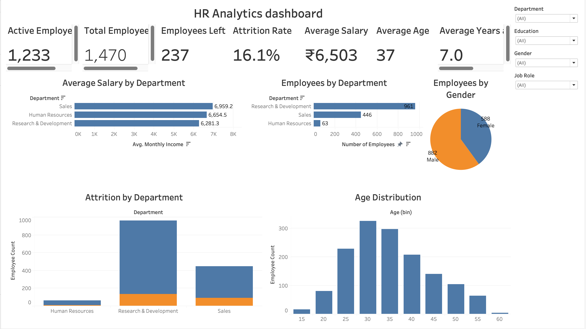

# HR Analytics Dashboard

## Overview

This project presents an interactive HR Analytics Dashboard developed using Tableau. It provides insights into employee attrition, workforce demographics, salary distribution, and departmental analysis through KPIs, charts, and interactive filters.

## Features

- 7 KPI Cards
- Employee Attrition Analysis
- Salary Analysis
- Department-wise Employee Distribution
- Gender Distribution
- Age Distribution
- Interactive Filters
- Tableau Story

## Tools Used

- Tableau Public
- Microsoft Excel

## Dashboard Preview

## Key Insights

- Total Employees: 1,470
- Active Employees: 1,233
- Attrition Rate: 16.1%
- Average Salary: ₹6,503
- Average Employee Age: 37 Years
- Average Years at Company: 7 Years

## Repository Contents

- `HR_Analytics_Dashboard.twbx` – Tableau packaged workbook
- `HR_Employee_Attrition.xlsx` – Dataset
- `dashboard.png` – Dashboard preview

## Skills Demonstrated

- Data Visualization
- Dashboard Design
- KPI Development
- HR Analytics
- Interactive Filtering
- Business Storytelling
